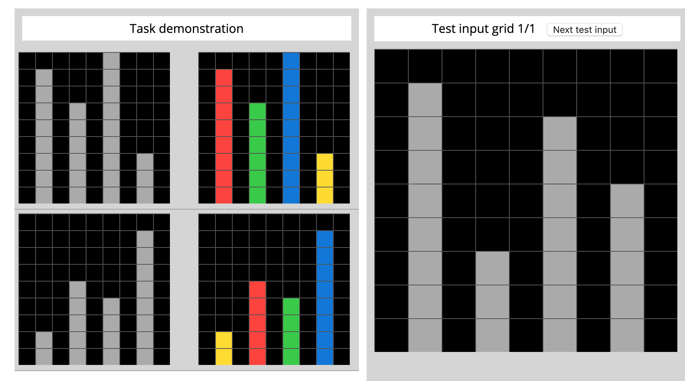

# kaggle 的通用人工智能比赛代码
https://www.kaggle.com/c/abstraction-and-reasoning-challenge/leaderboard

通过观察训练集上的图案转换规则，推导测试集上的图案该如何变化。每个用例只有几个训练案例，是典型的小样本问题。

目前已经将环境集成到gym中，尝试了dqn，不收敛， ac算法有时候不收敛，有时候直接退化，目前发现只有最简单的policy grident策略才能缓慢收敛，可以在多任务上收敛，但是测试集上无法泛化。 原因调查中。